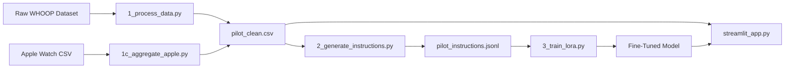

# 🛡️ Sumero Health AI - Proactive Health Coach

A privacy-first, multi-source health intelligence platform that provides **directive, time-specific health coaching** using biometric data from wearables like Apple Watch and WHOOP.

## 🚀 Features

### **Hybrid Intelligence Architecture**
- **Heuristic Engine**: Production-grade rule-based system with 15+ intent categories (zero dependencies, edge-ready)
- **Local LLM (Ollama)**: Privacy-first inference using Llama 3.2 or similar models
- **Cloud LLM (OpenAI)**: High-performance option for advanced reasoning

### **Multi-Source Data Fusion**
- **Population Health Data**: 374+ individuals from WHOOP-style studies (Occupation, Age, Lifestyle)
- **Apple Watch Raw Sensors**: High-resolution sleep stages (Deep, REM, Light), HRV proxy, and resting heart rate
- **Unified Schema**: Seamlessly merges both sources for comprehensive coaching

### **Proactive Coaching**
- **Time-Specific Directives**: "Sleep by 9:15 PM sharp", "Stop work at 4:45 PM"
- **Source-Aware**: Leverages Apple Watch precision metrics when available
- **Context-Driven**: Uses ALL biometrics (HR, Stress, Sleep stages, Steps, Occupation, Age, Gender, BMI)

---

## 📦 Installation

### **Prerequisites**
- Python 3.9+
- (Optional) Ollama for local LLM inference
- (Optional) OpenAI API key for cloud LLM

### **Quick Start**
```bash
# Clone the repository
git clone <your-repo-url>
cd archive

# Install dependencies
pip install -r requirements.txt

# Copy environment template
cp .env.example .env

# (Optional) Configure your API keys in .env
# OPENAI_API_KEY=your_key_here
# OLLAMA_MODEL=llama3.2

# Run the dashboard
streamlit run streamlit_app.py
```

---

## 🧠 Intelligence Layers

### **1. Heuristic Engine (Recommended for Edge Deployment)**
- **Zero dependencies**, instant responses
- Covers 15+ intent categories:
  - Sleep & Bedtime
  - Workout & Exercise
  - Stress & Mental Health
  - Fatigue & Energy
  - Naps
  - Steps & Activity
  - Work & Productivity
  - Nutrition & Hydration
  - Heart Rate Analysis
  - Recovery & Health State
  - BMI & Weight Management
  - Age-Related Guidance
  - Occupation-Specific Risks
  - General Status
  - Catch-All Fallback

### **2. Ollama (Local LLM)**
- Privacy-first: all data stays on your machine
- Requires: Ollama running locally (`ollama serve`)
- Models: `llama3.2`, `qwen2.5:7b`, `mistral`

### **3. OpenAI (Cloud LLM)**
- High-performance reasoning
- Requires: `OPENAI_API_KEY` in `.env`
- Model: GPT-4o

---

## 🧪 Test Prompt Suite

Use these prompts to validate all coaching categories:

### **Sleep & Bedtime**
- "When should I sleep tonight?"
- "What's my optimal bedtime?"
- "I need rest, when can I go to bed?"

### **Workout & Exercise**
- "Can I workout today?"
- "Should I hit the gym?"
- "Is it safe to run?"

### **Stress & Mental Health**
- "I feel stressed, what should I do?"
- "I'm feeling overwhelmed"
- "Help me with my anxiety"

### **Fatigue & Energy**
- "I feel exhausted today"
- "I'm so tired, what's wrong?"
- "How can I get more energy?"

### **Naps**
- "Should I take a nap?"
- "When's the best time for a power nap?"

### **Steps & Activity**
- "How are my steps today?"
- "Should I walk more?"

### **Work & Productivity**
- "When should I stop working?"
- "How long can I work today?"

### **Nutrition & Hydration**
- "What should I eat today?"
- "How much water should I drink?"

### **Heart Rate**
- "Is my heart rate normal?"
- "What does my HR mean?"

### **Recovery & Health State**
- "How's my recovery today?"
- "What's my health status?"

### **BMI & Weight**
- "Is my weight healthy?"
- "What about my BMI?"

### **Age-Related**
- "How does my age affect me?"

### **Occupation-Specific**
- "How does my job impact my health?"

### **General Status**
- "How am I doing overall?"
- "Give me a health summary"

---

## 📊 Data Pipeline



### **Pipeline Steps**
1. **Data Cleaning**: `1_process_data.py` - Curate population health data
2. **Apple Watch Aggregation**: `1c_aggregate_apple.py` - Process raw sensor data
3. **Instruction Generation**: `2_generate_instructions.py` - Create training pairs (617 samples)
4. **QLoRA Fine-Tuning**: `3_train_lora.py` - (Optional) Train custom health LLM
5. **Inference**: `streamlit_app.py` - Live dashboard with hybrid intelligence

---

## 🌐 Deployment

### **Local Development**
```bash
streamlit run streamlit_app.py
```
Access at: `http://localhost:8501`

### **Streamlit Cloud**
1. Push to GitHub
2. Connect at [share.streamlit.io](https://share.streamlit.io)
3. Deploy `streamlit_app.py`

### **Edge Devices (Smartbands, Embedded)**
- Use **Heuristic Layer** only (zero dependencies)
- No internet required
- Sub-millisecond response time

### **Ollama Server Mode**
Run Ollama as a central server:
```bash
OLLAMA_HOST=0.0.0.0:11434 ollama serve
```
Point clients to: `http://<your-ip>:11434`

---

## 🔐 Privacy & Security

- **Local-First**: All data processing can run entirely offline
- **No Tracking**: Zero telemetry or analytics
- **Environment Variables**: Sensitive keys stored in `.env` (gitignored)
- **HIPAA-Ready**: Heuristic layer has no data leakage risk

---

## 📁 Project Structure

```
archive/
├── streamlit_app.py              # Main dashboard (Hybrid Intelligence)
├── 1_process_data.py             # Population data cleaner
├── 1c_aggregate_apple.py         # Apple Watch data aggregator
├── 2_generate_instructions.py   # Training data generator
├── 3_train_lora.py              # QLoRA fine-tuning script
├── 4_inference.py               # Standalone inference tester
├── pilot_clean.csv              # Unified health dataset (617 rows)
├── pilot_instructions.jsonl     # Training pairs for LLM
├── requirements.txt             # Python dependencies
├── .env.example                 # Environment template
└── applewatchhrv/              # Raw Apple Watch data
```

---

## 🎯 Use Cases

1. **Personal Health Tracking**: Get directive advice based on your wearable data
2. **Clinical Trials**: Analyze population-level recovery patterns
3. **Occupational Health**: Identify burnout risks in high-stress professions (Doctors, Nurses)
4. **Edge AI Research**: Benchmark heuristic vs. LLM performance on health coaching
5. **Privacy-First Wellness Apps**: Deploy without cloud dependencies

---

## 🤝 Contributing

We welcome improvements! Focus areas:
- Additional biometric sources (Garmin, Fitbit)
- RAG (Retrieval-Augmented Generation) for few-shot examples
- Mobile app integration
- Fine-tuned model sharing

---

## 📄 License

MIT License - See `LICENSE` for details

---

## 🙏 Acknowledgments

- **Dataset**: Sleep Health and Lifestyle Dataset (Kaggle)
- **Models**: Meta (Llama 3.2), Alibaba (Qwen 2.5), OpenAI (GPT-4o)
- **Framework**: Streamlit, Hugging Face Transformers

---

## 📬 Support

For questions or issues:
- GitHub Issues: [Create an issue](https://github.com/your-repo/issues)
- Documentation: See `walkthrough.md` in `.gemini` artifacts

---

**Built with ❤️ for a healthier tomorrow.**
