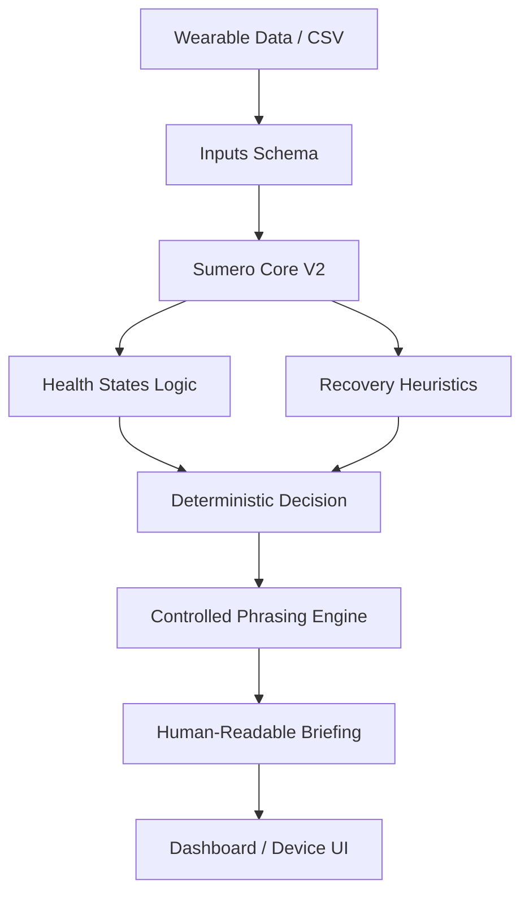

# 🛡️ Sumero Health AI - Proactive Health Coach

A privacy-first, multi-source health intelligence platform that provides **directive, time-specific health coaching** using biometric data from wearables like Apple Watch and WHOOP.

## 🚀 Features

### **Sumero Core (Deterministic V2 Engine)**
- **Deterministic Intelligence**: Industry-grade heuristic engine in `sumero_core/` that serves as the "Sole Authority" for health decisions.
- **Medical-Grade Calibration**: Incorporates **Blood Pressure** and **Resting Heart Rate** thresholds to detect "Silent Strain" (physiological load missed by subjective metrics).
- **Controlled Phrasing Engine**: Replaces generative AI with human-reviewed templates for 100% explainability and safety.
- **Contract-Driven**: Uses strict JSON/Pydantic-style schemas for inputs and decisions.
- **Validated Accuracy**: Backtested against 374 real-world users with a verified simulation rig.

---

## 📦 Installation

### **Prerequisites**
- Python 3.9+
- (Optional) Ollama for local LLM inference
- (Optional) OpenAI API key for cloud LLM

### **Quick Start (V2 Core)**
```bash
# Clone the repository
git clone https://github.com/moeezahmadkhan/sumero-health-archive.git
cd archive

# Run the simulation rig (V2)
python3 sumero_core/simulation.py
```

### **Run Dashboard**
```bash
streamlit run streamlit_app.py
```

---

## 🧠 Intelligence Layers

### **1. Sumero Core (V2 - Recommended)**
- **Deterministic & Auditable**: Every decision is traceable to a specific rule.
- **Medical Calibration**: 
    - **BP Threshold**: >135/88 triggers automatic recovery protocol.
    - **HR Threshold**: >80 BPM (Resting) signals physiological strain.
- **Phrasing Engine**: Uses clinical-grade templates in `phrasing.py`.

### **2. Hybrid Prototype (V1)**
- **Heuristic Engine**: Production-grade rule-based system with 15+ intent categories.
- **LLM Integration**: Supports local **Ollama** and cloud **OpenAI** for tone-polishing.

---

## 🧪 Test Suite & Simulation

### **V2 Backtesting (Simulation Rig)**
Validate the core engine against 374 users:
```bash
python3 sumero_core/simulation.py
```
- **Silent Strain Detection**: Successfully flags users with high BP even if sleep is optimal.
- **Distribution**: Verified ~58% Optimal / ~42% Remedial across the Sleep Health dataset.

### **Manual Prompts**
Use these categories on the dashboard to test heuristic/LLM responses:
- Sleep & Bedtime
- Workout Readiness
- Stress Interventions
- Occupational Risks (Doctor, Nurse, etc.)

---

## 📊 High-Level Architecture



---

## 📁 Project Structure

```
archive/
├── sumero_core/                  # Deterministic V2 Foundation
│   ├── engine.py                 # Core Orchestrator
│   ├── health_states.py          # State Determination Laws
│   ├── phrasing.py               # Deterministic Language Library
│   ├── simulation.py             # Backtesting Rig
│   ├── data/                     # Ground Truth (374 Users)
│   └── heuristics/               # Modular Decision Logic
├── streamlit_app.py              # Main dashboard
├── requirements.txt             # Python dependencies
├── .env.example                 # Environment template
└── pilot_clean.csv              # Unified dataset
```

---

## 🎯 Use Cases

1. **Personal Health Tracking**: Get directive advice based on your wearable data
2. **Clinical Trials**: Analyze population-level recovery patterns
3. **Occupational Health**: Identify burnout risks in high-stress professions (Doctors, Nurses)
4. **Edge AI Research**: Benchmark heuristic vs. LLM performance on health coaching
5. **Privacy-First Wellness Apps**: Deploy without cloud dependencies

---

## 🤝 Contributing

We welcome improvements! Focus areas:
- Additional biometric sources (Garmin, Fitbit)
- RAG (Retrieval-Augmented Generation) for few-shot examples
- Mobile app integration
- Fine-tuned model sharing

---

## 📄 License

MIT License - See `LICENSE` for details

---

## 🙏 Acknowledgments

- **Dataset**: Sleep Health and Lifestyle Dataset (Kaggle)
- **Models**: Meta (Llama 3.2), Alibaba (Qwen 2.5), OpenAI (GPT-4o)
- **Framework**: Streamlit, Hugging Face Transformers

---

## 📬 Support

For questions or issues:
- GitHub Issues: [Create an issue](https://github.com/your-repo/issues)
- Documentation: See `walkthrough.md` in `.gemini` artifacts

---

**Built with ❤️ for a healthier tomorrow.**
